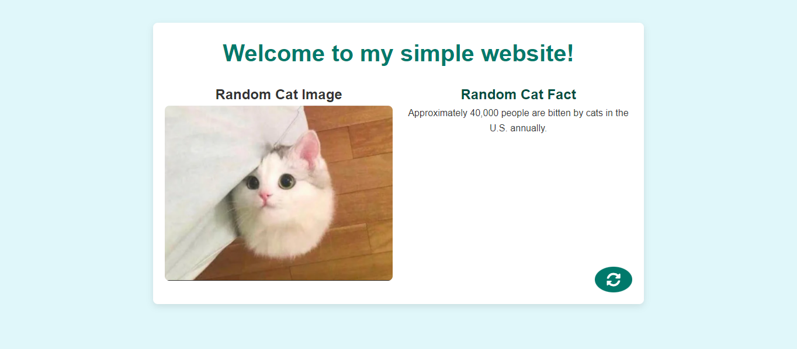
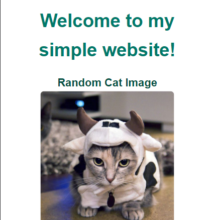

# simple-website

## Description
This project is a simple, cat-themed website that displays a random cat image and a random cat fact. The website is built using React.js for the frontend and Django (with 2 api endpoints) for the backend. The frontend is deployed on AWS S3, and the backend is deployed on AWS EC2. The site adapts to different screen sizes, ensuring a user-friendly experience on both desktop and mobile devices.

- Displays a random cat image.
- Displays a random cat fact.
- Refresh button to fetch new cat image and fact.
- Responsive design that adapts to different screen sizes.

## Table of Contents

- [Installation](#installation)
- [Usage](#usage)
- [Deployment](#deployment)
- [Badges](#badges)
- [Features](#features)
- [Screenshots](#screenshots)
- [Questions](#questions)

## Installation

To visit the site, please refer to the deployed application link in the [Usage](#usage) section.

For local testing and development:
1. Clone the repository: `git clone https://github.com/jskelly8/simple-website.git`
2. Navigate to the project directory: `cd simple-website`
3. Install dependencies for the client and server:
    ```bash
    cd client
    npm install
    cd ../server
    pip install -r requirements.txt
    ```
4. Build the client: 
    ```bash
    cd client
    npm run build
    ```
5. Start the server:
    ```bash
    cd ../server
    python manage.py runserver
    ```

## Usage

To visit the deployed application, click the following logo:
[](http://52.15.151.97/)

### Key Features
- Basic React frontend
- Django backend
- Integration with AWS services

### API Endpoints
- **GET** `/api/catfact/` - Fetches a random cat fact from an external API and returns it.
- **GET** `/api/catimage/` - Fetches a random cat image URL and returns it.

## Deployment

The application is deployed on AWS using the following services:
- **EC2** for hosting the server
- **Nginx** as a reverse proxy
- **Gunicorn** to serve the Django application
- **S3** for storing static and media files
- **CloudFront** for CDN

### Deployment Steps:
1. Launch an EC2 instance with Amazon Linux 2 AMI.
2. Install necessary dependencies (Python, Nginx, Gunicorn, etc.).
3. Configure Nginx as a reverse proxy.
4. Set up Gunicorn to serve the Django application.
5. Create an S3 bucket for static and media files.
6. Update the Django settings to use S3.
7. Create a CloudFront distribution and configure it to use the S3 bucket as the origin.

## Badges


## Features

- **React** for building user interfaces
- **Python** for developing the server-side logic
- **Django** for the backend
- **Nginx** as a reverse proxy
- **Gunicorn** as the WSGI HTTP server
- **AWS EC2** for hosting the application
- **AWS S3** for storing static and media files
- **AWS CloudFront** for CDN
- **GitHub** for version control

## Screenshots


*Desktop view of the website*


*Mobile view of the website*

## Questions

If you have any questions, feel free to reach out to me via [GitHub](https://github.com/jskelly8/) or email me at jessskelton888@gmail.com.